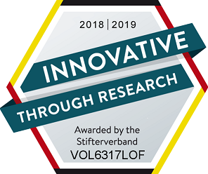

[Deutsche Version](.)


# 10 years of Volz Innovation GmbH
Since 2008 we have been supporting leading organisations in the use and development of new technologies. We combine methodological skills in design thinking and agile product development with solid project management and good communication. 

We belong to the leading German experts in Cloud Computing and Artificial Intelligence (AI). We understand and speak automotive, ICT, medical technology, and pharmaceuticals. 

Curious? We would be happy to discuss your project needs! 

## Customers

Our clients are innovation leaders in Germany and Switzerland, for example:


## Awards

Over the years we have received numerous awards for our work. For example, we will
for four years now by the Stifterverband der deutschen Wissenschaft for our innovation capabilities.




## Locations

In addition to our headquarters, we maintain project offices close to our current customer projects. 

Working students and interns can also work in our office in the[EMMA Creative Centre](http://www.emma-pf.de/) Pforzheim and find a creative environment there.

## Contact

Call us at [+49 70 83 93 93 28 338](tel:+4970839328338) or write to[info@volzinnovation.com](mailto:info@volzinnovation.com), encrypted (see below). We always welcome visitors, please make an appointment in advance by phone or e-mail:

Volz Innovation GmbH, Kirchhaldenweg 10, D-76597 Loffenau ([map](https://www.openstreetmap.org/way/220058489))

## Secure communication
Please use the following public PGP key to send us a confidential message. 
```
xsFNBFo0N4wBEADNoF5mLH/oa3gCCjdVf3VON4gNfTrFpyvXlzNjprSjmqXF
KTy73zhcELx+uTIsAvZJzn4La3ncUWf2SUbnjGsPL3qCl8ZMKugH3vcTZ6IE
5gKrS78wKnCegGdXN3rOfhOnoNr5hCYWFNVtmznKQGwNiCB3no68MtMeF3ly
0oMN9cc5bn2PRrHuRgr5acQefMOMorz3Rd1oxXZZuhnu10QsazEsJAezBrje
4ZFBXlpZQ5NHsOvWLkTYYu5PkQ5HdN1C2GzKsIKFv14jFUan0VLGr86cRLOI
PBN0J1MO/S6UABc2YMcWnnfADuwBVa6BCvpH6TIm5WRJ/8QZ0qY6vIyu5WwZ
4wBmFcPfXcauWXBIncI8KN/LMO3+rzlBtM1196G1zUo+k88dHhAj02Um4Er0
R0DEZskvF+POJ8zsXsVcl7JTqZBbfulA+KgLOxWy3kH7T3kpc8PgpqeweRz2
gywEebkfU8NGXf2S6FhiU9Zm+z7snDKcNwsRQUmQKEMzG2mXBoSO+aiBA5gz
5nlLDNVdYx5S1KMRyUQwd/VmI7D99sBIKIejx/y9bhg2kYLDc3PvykIFZdgI
GIKJFDG6FTxkXkCxjsG6KhE2pFkitzj/mJH+H011Ws6Ulprbnl9xQXzvu7qG
Yo/gggZzKVCPJtBkmRwdO8fRH8ri6YzNN0I5TwARAQABzSRSYXBoYWVsIFZv
bHogPHJ2QHZvbHppbm5vdmF0aW9uLmNvbT7CwXUEEAEIACkFAlo0N5IGCwkH
CAMCCRDV6plCPWFK/wQVCAoCAxYCAQIZAQIbAwIeAQAAG/kP/i+tLqFAfZ+c
xx92Ss0nhAmYbW/vwUxz/z0KjNwvhfYTKKTVS7po5YR2OxlmJo9wJIOYvAY4
nEp7b7DzAdPWmBpwEQlBYYU6CRJqImulZt94/CjzzGPSqASMZMNPSyE71CeS
HZMEziWVB6YnloRU651ZHf0Xdz41xJyn4abWmjzPPZRILZX08TZgzvBBgRJV
CAMbCY0XcfKawFOcJGHcyFzVUbDG5+XqKUnB2LtB1ok/zQK322pZpxREA2DB
3b1DWIYd/ewavGXyv3LJzJPKZYDBVyR55V94NjjicZzu6eCP+DjDiMtM+a0b
v+0iXTW5h+Z2OOFm3Gy5mHjLZ3JbWRR1l105dvUYPAjti0SgHMot+jsfOKw1
6G70SzOhXlcIl8Cj2wOOriLak1prQCTsycjo0ycRfk7snBjlmm6i44e546I/
OQ1ayygYXhDr7UQr0ruoWhv6Nl+pkHPJUmRNF8qhLSoCQ/H9L5QWlGb4VPlM
6YYVrFRYX3QzuFApmDGE6yx25OZrAPGCeBVPUrmapPTzb9yXQz4hDrVMwqoe
oCnNzvFeyovJwbVZIWIF605dZRr9k0oXF+Ogd/r1syjOU4Kyz9mWGK3Xekc2
MOSh+m15Jgo0xnBBvzN8dgDcIuLbDhKB64SyT7QX/00bZ5DRBgnMoERqBy25
2/q/rX05EUmYzsFNBFo0N4wBEACif+lNJTPYsxLtuBpgc/LvPky65eiG0WGN
6A/ouK+8napedHTyN0duDJlypi6ACE2FVEaWMLcSn1oDCMB2XulGwSCGCMMV
E+WPoQZ/HRQJbgR7hclW2w771fdeoDxXxMA9PkQYiKO9M1H4qbn5JF80Yd0A
rgou/pxK4cFI+BwdlloMbA9klJc6nBWaJGvDEYfNKIiADERtNi1tMN4bUFmK
W3e/WVIlrqZ8u0GOhEYtBmue66sarWhTtfX0P/oMV6krOZAS2wh1XnfvUqv5
Zkm6Qv8Kxgx0tHPWhNYiFC5dvNas5xB6LVeC3YaN5i4mbdLpQvOK2rVMpWXb
lCytlXMMrE0JU2RC7hywrj/JBSzHLfAEcmKJD/FYvO8hmgxEYhM2vw5h2LkK
XOh+fj4WCPAPWcv/LV5XnwF10UjzXdFLZQnGDmjAal3dWKD7Qh8cnbm6ygzR
+BcntLsDRWbuNkcbsRSd//ajjsjxgqAzSckdcF+xwDD0JVYd+6hLvzsTQbOJ
MLna4doKSnxmEcI7M8RYTv1n9SfeRvr6wFGd7x/k+yI/+AH/oiPPVI3f/hu2
XTAJ9Sp+mfBPdgs6k0paBWBI63MUxlVfG8Zi/vQ7DmFxSoPYslcjHgaoJREc
MwO3Lj4yvRLvJoAb+rtomix2MvqGgzAxVzECH3YOBbsDu8v4YQARAQABwsFf
BBgBCAATBQJaNDeWCRDV6plCPWFK/wIbDAAABy0QAI9y1xuwalpSYwZgfR6L
GRGit7CZMQ+xr7ifhGrx4iYDN4a7yjggPT7obe8ZVZsFtTTXl8kCi1+OyXxP
QY6x4uvFyMWn0XwOewmRUKMvM+1uzz+RVbyigW++0r9b+jQYksKaOQStN9jI
YfpXYArc7C2yXQXuVfDzMkjTfkYAfLf2w3PmnhZZxOsM0hKbRHzFQ38jIJ+G
qq2molQRK77WXA4jYAmyBzP41V5Pq4Dfoh7sBQ6ozckcRrtc6ruRvZFLVdHT
giZ2iUF80BbCbi5BIaBpOP/JqOjmmCiMFKXrGzau9z8cGZse6VwvdVtWzORK
GzkVVGRbdX21wwY/F4G2wOupohUkwfD8VOuqUoh2F3myhh6HTOJDQVm4g+NC
okTKZCy4Eyf12Nq1Se4M4tORs1MrdLMNgjfAoUxloqp6AvGZDfvFRANEWPYA
TiE9KNxF8LLPKEUJLO3qs/uOzsoWlfYPD8mzb0SSJlGatzaLjUj1/m+IJtSp
ZzAn7kzacI4ezpJEmuzWBmskRFb3zOKH4pv8kSr+bAqRLF1JJSyAxVVqDw2e
DWzeJtqfxLfp0hHxNKoXz/BbR4c7OuX0AGpPoAp0Tf0aLsTEFqMPwRbsaBh4
GeckqdIllm3muG7pHq1Kw5yKUYQM2uzWDQwk53ych1Iu2YTvQtoTkIrpwG9K
9fVW
=2Ski
-----END PGP PUBLIC KEY BLOCK-----
```

We also sign our e-mails with S/MIME to prove their authenticity.

## Imprint

Our provider identification according to § 5 TMG is as follows:

Volz Innovation GmbH, Kirchhaldenweg 10, 76597 Loffenau is represented by the managing partner Prof.Dr. Raphael Volz. You can reach us by phone at +49 7083 9328338 or send an e-mail to info@volzinnovation.com if you are currently online. The company is registered at the Mannheim Court of Registration under the registration number HRB 70 44 18. Our value added tax identification number according to §27 a value added tax law is DE 25 99 68 336.
Since we do not offer services to consumers, we participate in dispute resolution proceedings before a
consumer arbitration board.

### Liability for content
As a service provider we are responsible for our own contents on these pages according to § 7 Abs.1 TMG.
general laws. According to §§ 8 to 10 TMG, however, we as a service provider are not
to monitor third party information transmitted or stored on our Web site or, under certain circumstances
that indicate illegal activity.

Obligations to remove or block the use of information in accordance with the general terms and conditions of use.
Laws remain unaffected by this. However, any liability in this respect shall only become effective from the date of the
knowledge of a concrete violation of the law. On becoming aware of corresponding
We will immediately remove any violations of the law.

### Liability for links
Our website contains links to external websites of third parties over whose contents we have no influence.
Therefore, we cannot assume any liability for these external contents. For the contents of the
The respective provider or operator of the sites is always responsible for the content of the linked sites. The linked
pages were checked for possible legal infringements at the time of linking. illegal ones
Contents were not recognizable at the time of linking.

However, a permanent control of the contents of the linked pages is not possible without concrete indications of an
Violation of rights unreasonable. If we become aware of any infringements of the law, we will delete such links.
Remove immediately.

### Copyright
Contents and works on these pages are subject to German copyright law. Duplication, editing, distribution and any kind of use outside the limits of copyright law require the written consent of the respective author or creator. Downloads and copies of this site are only permitted for private, non-commercial use.

As far as the contents on this site were not created by the operator, the copyrights of third parties are respected. In particular, the contents of third parties are marked as such. Should you nevertheless become aware of a copyright infringement, please inform us accordingly. As soon as we become aware of any such infringements, we will remove such content immediately.

*Imprint based on https://www.e-recht24.de/impressum-generator.html*

## Privacy

We take the protection of your personal data very seriously. We treat your
personal data confidentially and in accordance with the legal data protection regulations as well as
this privacy policy.

Personal data will be deleted no later than 30 days after expiry of the legal retention periods. We regard all e-mails as business letters.

The use of our website is possible without providing any personal data at all. We do not use cookies or analysis software to track visitors and have no other interest or time to monitor the visitors of our website.

If (ever) personal data (such as name, address or e-mail addresses) should be collected on our website, this will be, as far as possible, always on a voluntary basis. Personal data will not be sold or passed on to third parties without your express consent.

We would like to point out that data transmission on the Internet (e.g. in communication by e-mail)
may have security holes. A complete protection of data against access by third parties is not possible with the current state of technology. You are welcome to use PGP and thereby at least make access to information more difficult for third parties. Please use the public key above for your communication with us.

### Right to information, deletion, blocking
You have the right to free information about your stored personal data at any time.
data, their origin and recipients and the purpose of the data processing as well as a right to
correction, blocking or deletion of this data. For this and other questions on the subject
personal data can be sent to the above address at any time.

*Privacy policy based on https://www.e-recht24.de/impressum-generator.html*


*[Translated with www.DeepL.com/Translator](www.DeepL.com/Translator)*
